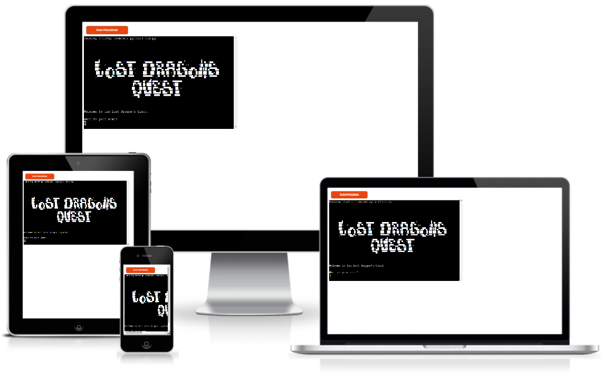
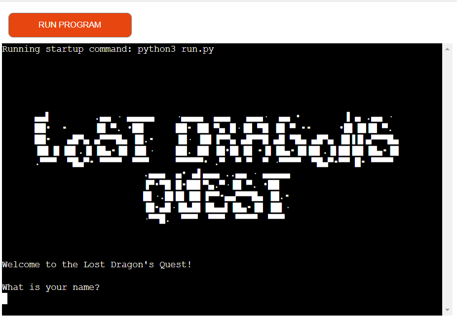
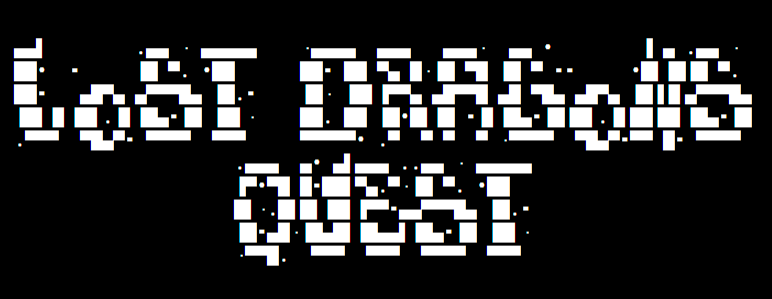
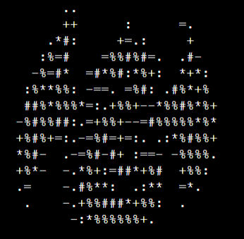
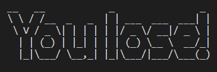
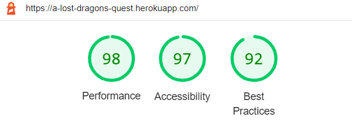

# Lost Dragon’s Quest

This is a text based adventure based in python. The game is a text adventure set in a magical land in planet Apollo.

The objetive of the game is to save your dragon that was capture by an evil warlock called Lord Orcus.

The Live Game can be accessed [HERE!]( https://a-lost-dragons-quest.herokuapp.com/)

 

## Table of Contents
- [Lost Dragon’s Quest](#lost-dragons-quest)
  - [Table of Contents](#table-of-contents)
  - [Features](#features)
    - [Existing Features](#existing-features)
    - [Future Features](#future-features)
  - [UX](#ux)
    - [Site Purpose](#site-purpose)
    - [Audience](#audience)
    - [User Goals](#user-goals)
  - [Design](#design)
    - [Flow Diagram](#flow-diagram)
  - [Testing](#testing)
    - [Bugs Fixed](#bugs-fixed)
  - [Technologies Used](#technologies-used)
  - [Deployment](#deployment)
    - [Using Heroku](#using-heroku)
    - [How to Fork it](#how-to-fork-it)
    - [How to Clone it](#how-to-clone-it)
    - [Making a Local Clone](#making-a-local-clone)
  - [Credits](#credits)
  - [Resources used in the process of the "Lost Dragon's Quest" game design and build:](#resources-used-in-the-process-of-the-lost-dragons-quest-game-design-and-build)

## Features
### Existing Features

The entire text-based game was created in Python. It aims to encourage player interaction and enjoyment. The story progresses partly due to the player's decisions; if they are inadequate, they suffer consequences. When the player makes the incorrect decision, and the game ends, they have the option of starting over. With each new replay, they can progress incrementally toward the eventual result and win the game.

-  Header

The Header is the first thing that the app displays. It has a contrasting font that draws attention to the game's title.

- Quest Start

Before the story begins, an ASCII image of a dragon is displayed.

- Win message

When you win the game, an ASCII message with the words "You Win!" appears.

- Lose message

When you lose the game, an ASCII message with the words "You Lose!" appears.

### Future Features

- To store the scores and add a player's name to a list with the time it took the user to win.
- To add 3 lives and every time you lose you can go back to the last scenario and choose something different until all the lives are gone.
- Increase the number of options and content.
- More options to pick weapons and a player's backpack inventory.

[Back to top](#lost-dragon-quest)

## UX
### Site Purpose
• To provide the player a basic yet entertaining game.
• To develop an immersive storyline that makes the user feel the importance of each decision
• To improve and sustain gaming instructions to the user.

### Audience
Anyone who enjoys a clear and concise text-based adventure.

### User Goals

- I am intrigued by how the game works.
- I want engaging adventures in the game.
- I want the game to create the scenario and lure me into the narrative.
- I want the decisions taken to feel as if they will have repercussions.
- I want the game to have clear win or lose rules, such as survival or death.
- I would like to be able to play the game again after it has ended.

[Back to top](#lost-dragon-quest)

## Design

### Flow Diagram

[Flow diagram](assets/testing/flow-chart.png)

The flow chart above, created with the website [Lucidchart](https://lucid.app/), provides a simplified overview of what I was trying to accomplish.

## Testing

- The application was constantly tested during development.
- To validate the code, the [PEP8 online validation tool](http://pep8online.com/) was used. The issues discovered are related to the blank spaces in the ASCII pictures.
- Lighthouse was used to test the app for Performance, Accessibility and Best Practices:
  
  

### Bugs Fixed
During the creation of the while loops with the nested if statements, I had some problems and had to research and learn how to use it properly making each if, elif, else break or call the right function to continue with the next part of the story.

[Back to top](#lost-dragon-quest)

## Technologies Used

- Python: Main language.
- [GitHub](https://github.com/): Used to store my repository for submission.
- [Gitpod](https://gitpod.io/): Used to develop the application.
- GitBash: Used to push the repository to Github.
- [Heroku](https://www.heroku.com/): Used host and deploy the application.
- [Lucidchart](https://www.lucidchart.com/): Used to make a flow diagram to help with the logic & flow of the code.
- [Am I Responsive?](https://ui.dev/amiresponsive): to ensure the project looked good across all devices.
- [Markdown cheat sheet](https://www.markdownguide.org/cheat-sheet/): to complete the Readme.
- Google Chrome DevTools – Used to debug and evaluate the site's responsiveness.

[Back to top](#lost-dragon-quest)

## Deployment

### Using Heroku
1. Use [Heroku](https://www.heroku.com/) to create a new app.
2. In Settings, add two buildpacks in the following order:
   - Python
   - NodeJS
3. Link the new app to the appropriate repository after granting Heroku access to GitHub.
4. Make the decision to enable Automatic Deploys or not. If enabled, each push to GitHub will result in an automatic update of the deployed app.
5. Click Deploy.

### How to Fork it
1. On GitHub, go to [CarmenCantudo/lost-dragon-quest]( https://github.com/CarmenCantudo/lost-dragon-quest).
2. In the top right, click "Fork".

### How to Clone it
1. Go to the main page of the repository.
3. Above the file list, click "Code".
4. Select HTTPS, SSH, or GitHub CLI and then click copy to clone it.
5. Open Git Bash.
6. Change the location of your cloned repository.
7. Type `git clone` and then paste the URL you copied.
8. Press “Enter” to create your clone.

### Making a Local Clone
1. Locate the [Repository]( https://github.com/CarmenCantudo/lost-dragon-quest).
2. Click "Code".
3. Click Clone or Download.
4. Copy the Git URL from the dialogue box.
5. Open a terminal window in your choosen directory using your preferred development editor.
6. Change the location to where you want the cloned directory to be.
7. Type `git clone`, and then paste the URL you copied.
8. Press Enter, and your local clone will be created.

[Back to top](#lost-dragon-quest)

## Credits

Resources used in the process of the "Lost Dragon's Quest" game design and build:
- 
- Help with general questions: [StackOverFlow](https://stackoverflow.com/)
- Love Sandwiches Code Institute project.

[Back to top](#lost-dragon-quest)